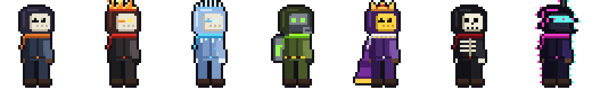
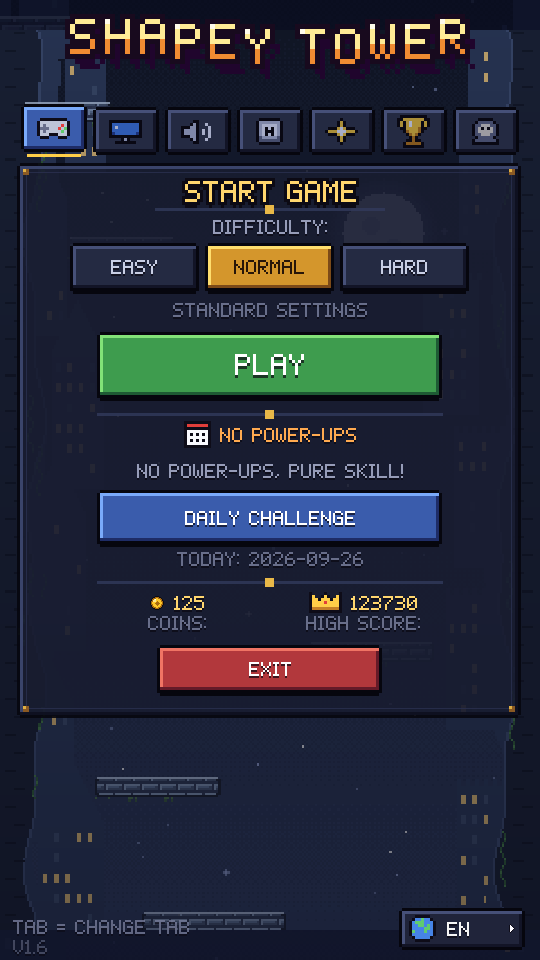
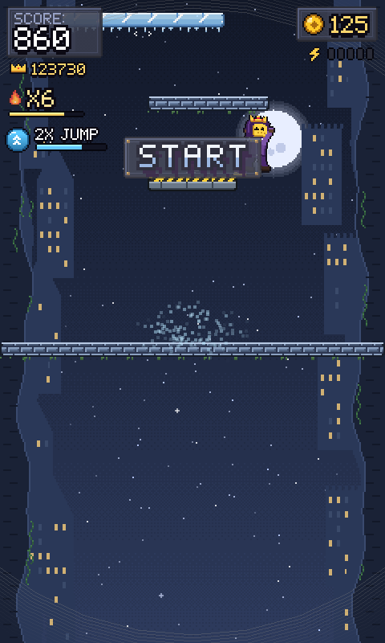
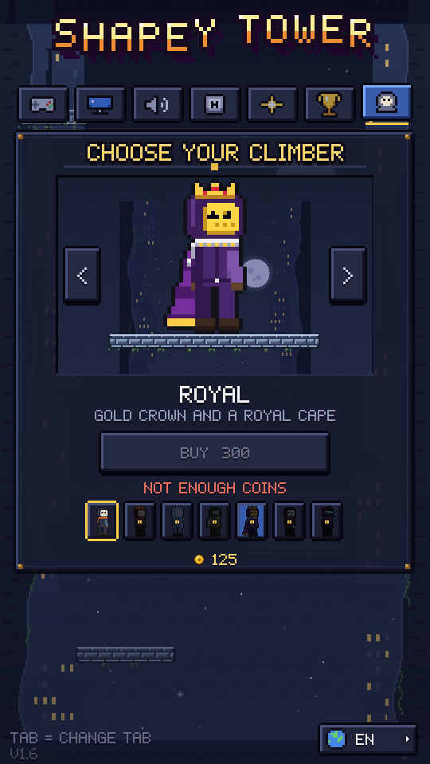
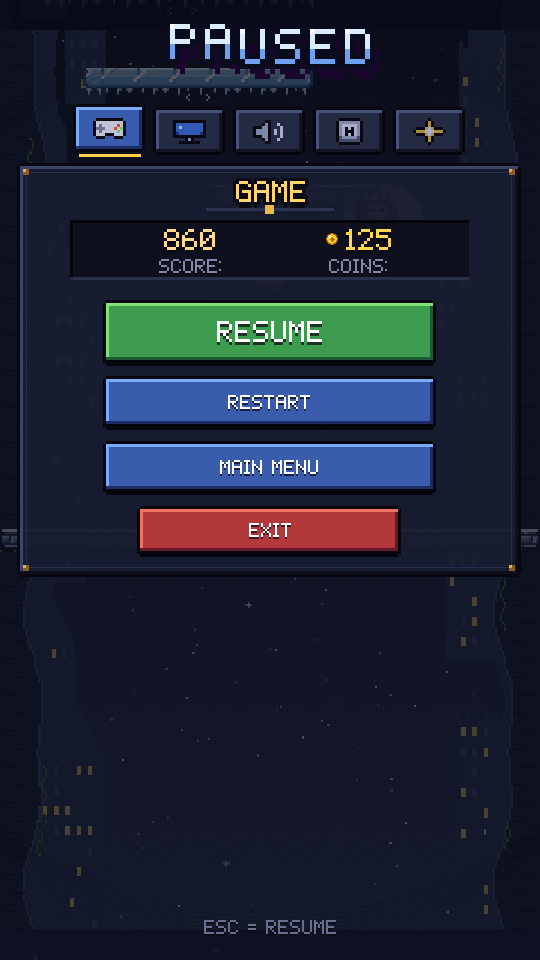
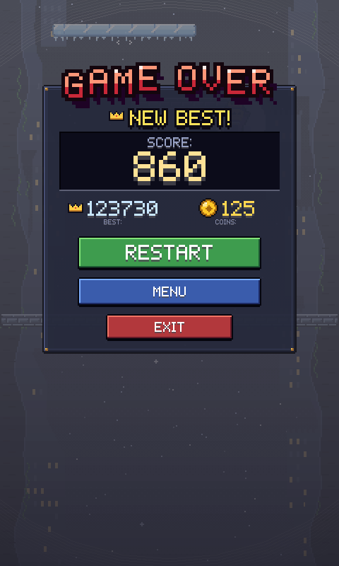

<div align="center">

# SHAPEY TOWER

**A pixel-art vertical platformer about climbing an endless tower before it swallows you.**

C++17 · raylib · all art generated by code



</div>

---

## Screenshots

<p align="center">
  
  
  
</p>
<p align="center">
  
  
</p>

## The game

The tower keeps scrolling up, and it gets faster every 30 seconds. Jump from
platform to platform, chain landings into combos, grab coins and power-ups, and
don't fall behind the bottom of the screen.

- **Twelve themed stretches of tower** with their own pixel-art parallax, from
  castle ramparts to lava, glaciers, a neon city and deep space.
- **Tricky platforms**: moving, crumbling, springy, icy and disappearing ones.
- **Wall grab and wall jump**: hold towards a wall while falling to slide down
  it, then jump off.
- **Power-ups**: double jump, shield, slow motion and coin magnet.
- **Combo system**: land platform after platform to build a multiplier. At x10
  you catch fire.
- **Revive**: spend coins to get a second chance.
- **Daily challenge**: a new seeded run every day with modifiers such as
  *Ice World*, *Crumble Chaos* or *No Power-ups*.
- **Three difficulties**, 11 achievements, a local leaderboard and lifetime
  stats.
- **Hero shop**: seven climbers bought with coins. Each one has its own gear:
  a flame crest, an icicle crown, a gas mask with a tank, a crown and cape, a
  skull face, or a broken glitch visor.
- **English and Polish** UI, a first-run tutorial, gamepad support, rebindable
  keys and resolution, V-Sync and FPS options.

## Controls

| Action              | Keyboard (default) | Gamepad          |
|---------------------|--------------------|------------------|
| Move                | `A` / `D`          | Left stick       |
| Jump / wall jump    | `Space`            | `A` / `Y`        |
| Pause / back        | `Esc`              | `Start` / `Back` |
| Next menu tab       | `Tab`              |                  |
| Toggle FPS counter  | `F3`               |                  |

Keys can be rebound under **Keys** in the menu or the pause screen.

## Building

Requirements: CMake 3.20+, a C++17 compiler and raylib 5.x.

**Windows (MSYS2 UCRT64, recommended)**

```bash
pacman -S mingw-w64-ucrt-x86_64-gcc mingw-w64-ucrt-x86_64-cmake mingw-w64-ucrt-x86_64-ninja mingw-w64-ucrt-x86_64-raylib
cmake -S . -B build -G Ninja -DCMAKE_BUILD_TYPE=Release
cmake --build build
./build/shapeytower.exe
```

The build copies `assets/` and the required DLLs next to the executable.

**Linux / macOS**: install raylib with your package manager (for example
`brew install raylib`) and use the same two CMake commands. These platforms
are not tested regularly.

**VS Code**: `.vscode/` has tasks for configure, build, run, install and
packaging, plus gdb launch configurations.

**Packaging**: `cmake --install build --prefix dist` stages a portable build,
and `cpack` (run from `build/`) produces a ZIP.

## Art pipeline

The pixel art is not drawn by hand. It is generated by small, dependency-free
Python scripts. Edit the script, run it, and the PNGs in `assets/textures/` are
rebuilt:

| Script                          | Produces                                                    |
|---------------------------------|-------------------------------------------------------------|
| `tools/make_player_sprite.py`   | `player_sheet.png`: 10 animation frames × 7 skins           |
| `tools/make_world_art.py`       | `tiles.png`, `items.png`, `bg_0..8.png` (parallax layers)   |
| `tools/pixpng.py`               | shared canvas and PNG writer                                |

```bash
python tools/make_player_sprite.py --preview                # + enlarged preview sheet
python tools/make_player_sprite.py --showcase skins.png     # all skins side by side
python tools/make_world_art.py --preview                    # + tile/scene previews in tools/
```

The UI font, icons and frames are baked at startup from bitmaps in
`src/ui_kit.cpp`, so the UI needs no extra asset files.

## Project layout

```
assets/        audio, textures (generated), shader, icon
docs/          README screenshots
include/       headers
resources/     Windows icon resource
src/           game sources (entry point: src/main.cpp)
  game.cpp            game loop, physics, spawning
  game_render.cpp     world, HUD, game over, revive
  game_ui_menu.cpp    main menu and hero shop
  game_ui_pause.cpp   pause screen
  ui_kit.cpp          pixel font, icons and widgets
  world_art.cpp       tiles, parallax, items
tools/         art generators
```

Save data (`highscore.txt`, `coins.txt`, `skins.txt`, `settings.cfg`, stats and
leaderboard) is written next to the executable.

## License

**Proprietary. All rights reserved.** This is not open-source software. You may
not copy, modify, distribute, run or reuse any part of this project, including
its art and audio, without prior written permission. See [LICENSE](LICENSE) for
the full terms.

Built with [raylib](https://www.raylib.com/), which is licensed separately
under the zlib/libpng license.
